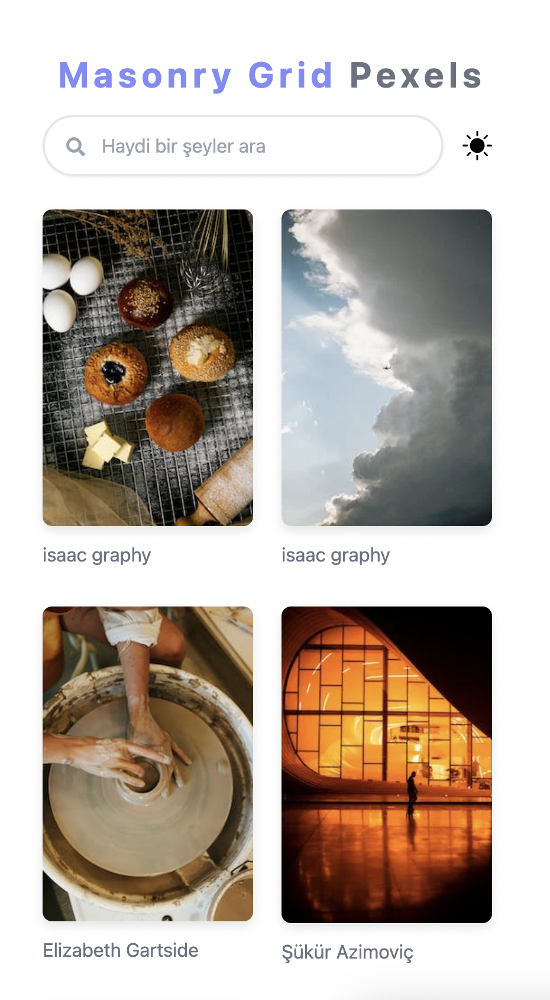

# Pexels Resim Galerisi Uygulaması

Bu uygulama, Pexels API'sini kullanarak resimleri görüntülemek için oluşturulmuştur. Kullanıcılar rastgele resimlere göz atabilir, anahtar kelimelerle resim arayabilir ve resimleri büyüterek detaylı görüntüleyebilirler.

## Özellikler

- Rastgele resimleri görüntüleme
- Anahtar kelime aramasıyla resimleri filtreleme
- Resimleri büyüterek detaylı görüntüleme
- Kullanıcı dostu arayüz
- Koyu mod desteği

## Kullanım

1. Uygulamayı başlatmak için `npm install` komutunu kullanarak gerekli bağımlılıkları yükleyin.
2. Ardından `npm run dev` komutuyla uygulamayı başlatabilirsiniz.
3. Tarayıcınızda `http://localhost:5173` adresine giderek uygulamayı kullanabilirsiniz.

## Kullanılan Teknolojiler

- React.js
- Pexels API
- Zustand
- Tailwind CSS
- React Icons
- Masonry Grid

## Ekran Görüntüleri

  

  
  
  
  

---

Bu uygulama, React Js, Zustand kullanımını ve harici API entegrasyonu konularını anlamak için oluşturulmuştur. İstediğiniz gibi geliştirebilir ve özelleştirebilirsiniz.

**Not:** Bu uygulama Pexels API'sini kullanmaktadır. Kendi API anahtarınızı kullanarak denemeler yapabilirsiniz.
